<div align="center">

# ☕ Java Full Stack — Complete Study Notes


**Author: Mohammad Asfin &nbsp;|&nbsp; Stack: Java Full Stack &nbsp;|&nbsp; Level: Beginner to Advanced**

[🚀 Get Started](#-java-introduction--features) · [📚 OOP Concepts](#-oop-object-oriented-programming) · [🔗 JDBC](#-jdbc-java-database-connectivity) · [🌐 REST API](#-rest-api--web-services) · [📦 Maven & Gradle](#-maven) · [🧵 Multithreading](#-multithreading)

</div>

---

## 🗺️ Java Full Stack Learning Roadmap

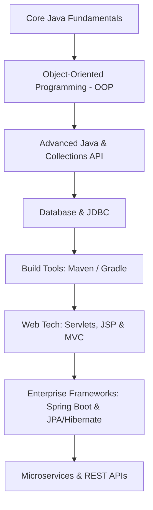

---

## 📋 Table of Contents

<details>
<summary>Click to expand full Table of Contents</summary>

- [☕ Java Introduction & Features](#-java-introduction--features)
- [⬇️ Java Installation](#️-java-installation)
- [⚙️ Java Fundamentals](#️-java-fundamentals)
  - [JDK · JRE · JVM Architecture](#-jdk--jre--jvm-architecture)
  - [How Java Works (Compile → Run)](#-how-java-works)
  - [JShell — Java REPL](#-jshell--java-repl)
  - [Variables, Identifiers & Name Conventions](#-variables-identifiers--name-conventions)
  - [Primitive Data Types](#-primitive-data-types)
  - [Literals & Type Conversion](#-literals--type-conversion)
  - [Wrapper Classes](#-wrapper-classes)
- [🖨️ Input & Output Statements](#️-input--output-statements)
  - [Scanner Class](#-scanner-class)
  - [Console Class](#-console-class)
  - [Command Line Arguments](#-command-line-arguments)
  - [DataInputStream](#-datainputstream)
- [🔢 Operators](#-operators)
- [🔀 Control Statements](#-control-statements)
- [📦 Arrays](#-arrays)
- [🔡 Strings](#-strings)
  - [StringBuffer & StringBuilder](#-stringbuffer--stringbuilder)
- [🏛️ OOP — Object Oriented Programming](#-oop-object-oriented-programming)
  - [OOP vs POP](#-oop-vs-pop)
  - [Classes & Objects](#-classes--objects)
  - [Access Specifiers](#-access-specifiers)
  - [Constructors](#-constructors)
  - [Methods](#-methods)
  - [Encapsulation](#-encapsulation)
  - [Inheritance](#-inheritance)
  - [Polymorphism](#-polymorphism)
  - [Abstraction](#-abstraction)
  - [Static Keyword](#-static-keyword)
  - [this & super Keyword](#-this--super-keyword)
- [🔌 Interface](#-interface)
- [📊 Enum](#-enum)
- [🏷️ Annotations](#️-annotations)
- [🔄 Functional Interface & Lambda Expressions](#-functional-interface--lambda-expressions)
- [⚠️ Exception Handling](#️-exception-handling)
- [🧵 Multithreading](#-multithreading)
- [📦 Packages](#-packages)
- [🖼️ Java Swing & GUI](#️-java-swing--gui)
- [🗂️ File I/O (Input & Output Streams)](#️-file-io-input--output-streams)
- [🔄 Serialization & Deserialization](#-serialization--deserialization)
- [📚 Collections API](#-collections-api)
- [🌊 Stream API](#-stream-api)
- [🔗 JDBC — Java Database Connectivity](#-jdbc-java-database-connectivity)
- [🌐 Servlets & JSP](#-servlets--jsp)
- [🌍 REST API & Web Services](#-rest-api--web-services)
- [🗺️ ORM Tools (Hibernate / JPA)](#️-orm-tools)
- [📦 Maven](#-maven)
- [🐘 Gradle](#-gradle)
- [🧪 JUnit Testing](#-junit-testing)
- [📁 Git & Version Control](#-git--version-control)
- [🏗️ DSA — Data Structures & Algorithms](#️-dsa--data-structures--algorithms)

</details>

---

## ☕ Java Introduction & Features

### Definition & Core Philosophy
Java is a **high-level, class-based, object-oriented programming language** designed by **James Gosling** at **Sun Microsystems** (now owned by **Oracle**) in **1995**. The core philosophy of Java is summarized as **"Write Once, Run Anywhere" (WORA)**.

### Why It Exists & Why We Use It
Before Java, languages like C and C++ compiled directly to target machine architectures, creating platform-dependent binaries. If you compiled a program on Windows, it would not run on a Macintosh without rewriting or recompiling the code. Java solved this by compiling source code to a standardized intermediary format called **Bytecode**, which runs on any hardware environment containing a **Java Virtual Machine (JVM)**.

### 🌟 Key Features of Java
* **Simple:** Removes complex, unsafe features like explicit pointers, operator overloading, and multiple inheritance.
* **Object-Oriented:** Follows class-based designs where everything (except primitives) is modeled as objects.
* **Platform Independent:** Bytecode is architecture-neutral and executes on any JVM.
* **Secure:** Operates inside a security sandbox, avoiding direct pointer allocation or memory leakage exploits.
* **Robust:** Employs strong type checking, automatic garbage collection (GC), and structured Exception Handling.
* **Multithreaded:** Allows concurrent execution of threads using integrated threading classes.

### Advantages & Disadvantages
* **Advantages:** Great community support, extreme portability, highly scalable, enterprise-grade frameworks.
* **Disadvantages:** Uses more memory and runs slower compared to native compiled languages (like C/Rust) because of JVM translation and Garbage Collection pauses.

### Real-World Use Case
* Enterprise backends (Spring Boot, banking apps)
* Android application development
* High-frequency trading and transaction engines

---

## ⬇️ Java Installation & Configuration

### Step 1 — Download JDK
1. Go to [Oracle JDK Downloads](https://www.oracle.com/java/technologies/downloads/) or [Eclipse Adoptium](https://adoptium.net/).
2. Select your Operating System version (Windows, macOS, or Linux).

### Step 2 — Environment Setup
Add JDK binary path to system environment variables so you can execute `javac` and `java` globally.

```bash
# Windows
JAVA_HOME = C:\Program Files\Java\jdk-21
PATH      = %JAVA_HOME%\bin

# macOS / Linux (.bashrc or .zshrc)
export JAVA_HOME=/usr/lib/jvm/jdk-21
export PATH=$JAVA_HOME/bin:$PATH
```

Verify the environment configuration:
```bash
java --version
javac --version
```

---

## ⚙️ Java Fundamentals

### 🏗️ JDK · JRE · JVM Architecture

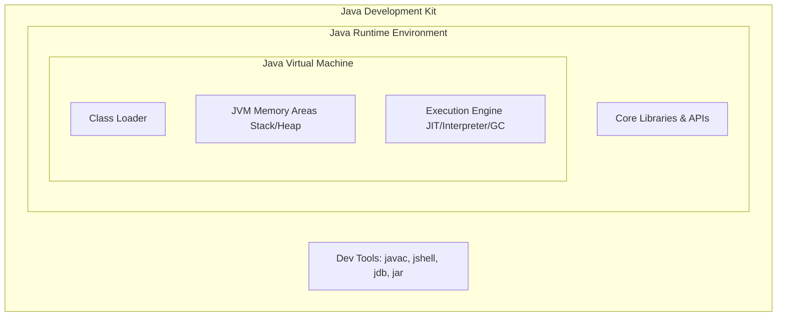

| Component | Definition | Purpose / Role |
| :--- | :--- | :--- |
| **JVM** | Java Virtual Machine | Runs the compiled bytecode (`.class` files) on the local processor. |
| **JRE** | Java Runtime Environment | Contains JVM + Java libraries required to run pre-compiled Java applications. |
| **JDK** | Java Development Kit | JRE + Dev Tools (compiler `javac`, packager `jar`). Required to develop Java code. |

#### JVM Internal Architecture

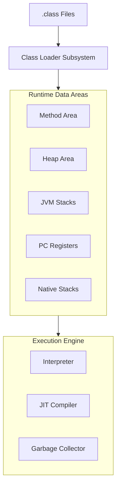

* **Class Loader:** Loads, links, and initializes compiled binary `.class` bytecode files.
* **Method Area:** Stores class structure definitions, constant pools, metadata, and static fields.
* **Heap Area:** Stores all run-time instantiated Java objects and arrays.
* **JVM Stack:** Stores local variables, frame structures, and method parameters for execution.
* **JIT Compiler:** Optimizes hot segments of bytecode into native machine instructions for direct speedups.

---

### 🔄 How Java Works: Compilation to Execution

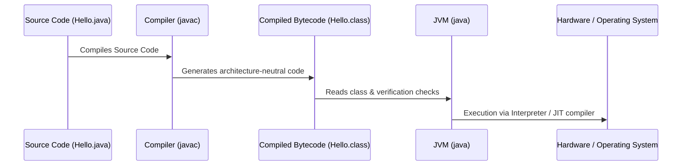

1. **Compilation Phase:** The compiler (`javac`) processes the human-readable `.java` file into platform-independent `.class` files containing JVM bytecode instructions.
2. **Execution Phase:** The launcher (`java`) starts the JVM, loads the compiled class, verifies the instruction constraints, and interprets/compiles the bytecode into local machine operations.

---

### 💻 JShell — Java REPL

**JShell** (introduced in Java 9) is a **Read-Eval-Print Loop** CLI tool used to test code snippets, declarations, and loops dynamically.

```bash
# Open JShell
jshell

# Type any code statement
jshell> System.out.println("Hello, JShell!");
Hello, JShell!

# Declare variables without explicit wrapping classes
jshell> int count = 5
count ==> 5

# Exit JShell
jshell> /exit
```

---

### 📌 Variables, Identifiers & Name Conventions

#### Variables
* **Definition:** A variable is a named container that represents a dedicated memory location allocated to store values during program execution.
* **Why it exists:** Variables allow programmers to write reusable and dynamic algorithms. Without variables, all data values would have to be hardcoded, making dynamic runtime processing impossible.
* **Types of Variables:**
  1. **Local Variables:** Declared inside a method body, block, or constructor. They are created when the block is entered and destroyed when exiting the block. They do not get default values and must be initialized before use.
  2. **Instance Variables:** Declared inside the class but outside any method. They belong to instances (objects) of the class. They are initialized with default values (e.g., `0` for int, `null` for objects).
  3. **Static (Class) Variables:** Declared with the `static` keyword inside a class. Only one copy exists per class, shared across all instantiated objects.

```java
public class VariableDemo {
    // 1. Static (Class) Variable - shared by all instances
    static int staticCounter = 0;

    // 2. Instance Variable - unique to each object instance
    String studentName;

    // Constructor to initialize instance variable
    public VariableDemo(String name) {
        this.studentName = name;
        staticCounter++; // increment shared counter
    }

    public void displayDetails() {
        // 3. Local Variable - scope limited to this method
        int localScore = 95; 
        System.out.println("Name: " + studentName + ", Score: " + localScore);
    }
}
```

#### Identifiers
* **Definition:** An identifier is a user-defined name given to program elements such as classes, variables, methods, packages, or interfaces.
* **Difference between Variables and Identifiers:** An identifier is the *name* itself, whereas a variable is the *storage container* referenced by that name. For example, in `int score = 100;`, `score` is both an identifier (the name) and a variable (the memory container).

#### Rules for Declaring Identifiers
* Must begin with a letter (`A-Z`, `a-z`), an underscore (`_`), or a dollar sign (`$`). It cannot start with a digit.
* Cannot contain spaces or special symbols (except `_` and `$`).
* Cannot be a reserved Java keyword (like `class`, `public`, `int`).
* Case-sensitive: `myVariable` and `myvariable` are treated as distinct identifiers.

#### Java Naming Conventions

| Element | Convention | Example |
| :--- | :--- | :--- |
| **Class** | PascalCase | `StudentDetails`, `BankAccount` |
| **Interface** | PascalCase | `Runnable`, `Serializable` |
| **Method** | camelCase | `calculateTax()`, `getName()` |
| **Variable** | camelCase | `totalScore`, `studentAge` |
| **Constant** | UPPER_SNAKE_CASE | `MAX_VALUE`, `DEFAULT_PI` |
| **Package** | lowercase | `com.example.myproject` |
| **Enum** | PascalCase | `DayOfWeek`, `TrafficLight` |


---

### 🗃️ Primitive Data Types

#### Definition & Memory Design
Java is a statically-typed language, meaning every variable must be declared with a data type before compilation. Java supports **8 primitive data types** that represent raw values. Primitives are stored directly in the thread's execution stack memory, which makes accessing them extremely fast.

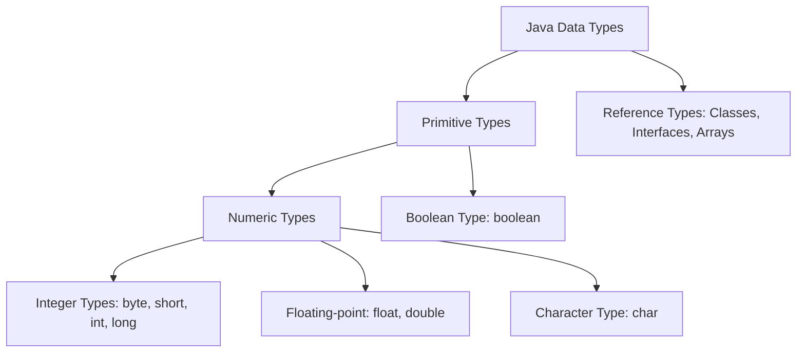

| Type | Size (Bytes) | Default Value | Min Value / Max Value | Range / Description |
| :--- | :--- | :--- | :--- | :--- |
| **byte** | 1 | `0` | `-128` to `127` | Useful for saving memory in large arrays. |
| **short** | 2 | `0` | `-32,768` to `32,767` | Half the size of `int`. |
| **int** | 4 | `0` | `-2^31` to `2^31 - 1` | Default type for integer literals. |
| **long** | 8 | `0L` | `-2^63` to `2^63 - 1` | Used when `int` is insufficient. Must end with `L`. |
| **float** | 4 | `0.0f` | IEEE 754 float | 6-7 decimal places of precision. Must end with `f`. |
| **double** | 8 | `0.0d` | IEEE 754 double | Default type for decimals. 15-16 decimal places. |
| **char** | 2 | `'\u0000'` | `0` to `65,535` | Holds a single 16-bit Unicode character. |
| **boolean**| 1 bit (JVM dependent)| `false` | `true` or `false` | Represents logical states. |

---

### 🔢 Literals & Type Conversion

#### Literals
A literal is a fixed value represented directly in code.
```java
int decimal = 100;           // Decimal literal
int octal   = 0144;          // Octal literal (prefix '0')
int hex     = 0x64;          // Hexadecimal literal (prefix '0x')
int binary  = 0b01100100;    // Binary literal (prefix '0b') - Java 7+
long largeVal = 10_000_000L; // Underscores for readability - Java 7+
```

#### Type Conversion
There are two types of conversion:
1. **Widening (Implicit):** Automatically promoted by the compiler from a smaller datatype to a larger one. No data loss can occur.
   `byte` ➡️ `short` ➡️ `char` ➡️ `int` ➡️ `long` ➡️ `float` ➡️ `double`
2. **Narrowing (Explicit Cast):** Manually casting a larger type to a smaller type. Can lead to fractional truncation or bit-level overflow.

```java
// Widening (Implicit)
int number = 100;
double doubleNumber = number; // Automatic conversion

// Narrowing (Explicit)
double val = 9.78;
int truncatedVal = (int) val; // truncatedVal becomes 9 (fractional loss)

// Overflow Example
int largeInt = 130;
byte overflowedByte = (byte) largeInt; // overflowedByte becomes -126 due to sign bit wrap
```

---

### 🎁 Wrapper Classes

#### Definition & Purpose
Wrapper classes wrap primitive types in objects. This enables primitives to interact with Java's Object-oriented architecture, such as Collections (e.g. `ArrayList<Integer>`), Generics, and reflection.

#### Autoboxing & Unboxing
* **Autoboxing:** Automatic conversion of primitives into their corresponding wrapper classes (e.g., `int` to `Integer`).
* **Unboxing:** Automatic conversion of wrapper objects back into their corresponding primitives.

```java
// Autoboxing
Integer ageObj = 25; // compiler translates to Integer.valueOf(25)

// Unboxing
int age = ageObj;    // compiler translates to ageObj.intValue()
```

> [!TIP]
> **Integer Caching Mechanism:**
> For performance optimization, Java caches Integer objects for values in the range `-128` to `127`.
> ```java
> Integer a = 127;
> Integer b = 127;
> System.out.println(a == b); // Prints true (points to cached instance)
> 
> Integer c = 128;
> Integer d = 128;
> System.out.println(c == d); // Prints false (new instances created on heap)
> ```


---

## 🖨️ Input & Output Statements

Java provides multiple ways to capture input from users and print outputs.

### Comparison: Input Reading Mechanisms

| Mechanism | Speed | Stream Source | Best Used For | Notes |
| :--- | :--- | :--- | :--- | :--- |
| **Scanner** | Slower (performs parsing) | `System.in`, files | Quick interactive CLI parsing | Easy to read primitives (`nextInt`, `nextDouble`). |
| **BufferedReader** | Very Fast (buffers input) | `InputStreamReader` | Reading large blocks of text | Only returns Strings; must manually parse values. |
| **Console** | Fast | System Console | Secure credential prompts | Doesn't work inside GUI IDE run consoles; shields inputs. |

---

### 🔍 Scanner Class
* **Definition:** Part of the `java.util` package, used to parse primitive types and strings using regular expressions.
* **Why it exists:** Introduced in Java 5 to simplify reading input without using verbose BufferedReader configurations.

> [!WARNING]
> **The Scanner buffer pitfall:**
> When calling `nextInt()` or `nextDouble()`, the numeric value is consumed but the trailing newline character `\n` remains in the stream buffer. A subsequent call to `nextLine()` immediately consumes this newline and returns an empty string instead of waiting for user input.
> 
> **How to fix:** Call an extra `sc.nextLine()` to clear the buffer before reading strings.

```java
import java.util.Scanner;

public class ScannerPitfallDemo {
    public static void main(String[] args) {
        Scanner sc = new Scanner(System.in);

        System.out.print("Enter your Age: ");
        int age = sc.nextInt(); // Leaves '\n' in the input stream buffer

        sc.nextLine(); // Clear the buffer!

        System.out.print("Enter your Full Name: ");
        String name = sc.nextLine(); // Successfully waits for input

        System.out.println("Name: " + name + ", Age: " + age);
        sc.close();
    }
}
```

---

### 🖥️ Console Class
* **Definition:** `java.io.Console` provides secure character-based console input methods.
* **Security Benefit:** `readPassword()` disables echoing of password characters on screen, preventing shoulder-surfing.

```java
public class ConsoleDemo {
    public static void main(String[] args) {
        java.io.Console console = System.console();
        if (console == null) {
            System.out.println("Console is not available in non-interactive environment.");
            return;
        }

        String username = console.readLine("Enter username: ");
        char[] password = console.readPassword("Enter password: "); // Securely reads password

        console.printf("Authentication successful for %s.%n", username);
    }
}
```

---

### 📟 Command Line Arguments
* **Definition:** Array of strings passed to the `main(String[] args)` method at execution runtime.
* **Best practice:** Always check the `args.length` before attempting to access array elements to avoid raising an `ArrayIndexOutOfBoundsException`.

```java
public class CommandLineArgsDemo {
    public static void main(String[] args) {
        if (args.length < 2) {
            System.out.println("Usage: java CommandLineArgsDemo <name> <age>");
            return;
        }
        String name = args[0];
        int age = Integer.parseInt(args[1]); // Parse string argument
        System.out.println("Hello " + name + ", age " + age);
    }
}
```

---

### 📥 BufferedReader & DataInputStream
Historically, `DataInputStream` was used to read primitives directly from a system pipeline, but it is deprecated for text console reading. Instead, we use `BufferedReader` for fast line-by-line character input.

```java
import java.io.*;

public class BufferedReaderDemo {
    public static void main(String[] args) throws IOException {
        // BufferedReader uses a character buffer to read inputs efficiently
        BufferedReader reader = new BufferedReader(new InputStreamReader(System.in));

        System.out.print("Enter product price: ");
        double price = Double.parseDouble(reader.readLine()); // parse readLine string

        System.out.println("Price read: " + price);
    }
}
```


---

## 🔢 Operators

Operators are special symbols that perform operations on operands (values/variables).

### Types of Operators

| Type | Operators |
| :--- | :--- |
| **Arithmetic** | + - * / % |
| **Assignment** | = += -= *= /= %= &= |= ^= <<= >>= |
| **Relational** | == != > < >= <= |
| **Logical** | && || ! |
| **Bitwise** | & | ^ ~ << >> >>> |
| **Unary** | + - ++ -- ! ~ |
| **Ternary** | condition ? valueIfTrue : valueIfFalse |
| **instanceof** | obj instanceof ClassName |

```java
public class OperatorsDemo {
    public static void main(String[] args) {

        // 1. ARITHMETIC OPERATORS
        int a = 10, b = 3;
        System.out.println(a + b);   // 13 (Addition)
        System.out.println(a - b);   // 7  (Subtraction)
        System.out.println(a * b);   // 30 (Multiplication)
        System.out.println(a / b);   // 3  (Division — integer)
        System.out.println(a % b);   // 1  (Modulus / Remainder)

        // 2. ASSIGNMENT OPERATORS
        int x = 5;
        x += 3;   // x = x + 3 = 8
        x -= 2;   // x = x - 2 = 6
        x *= 4;   // x = x * 4 = 24
        x /= 3;   // x = x / 3 = 8
        x %= 3;   // x = x % 3 = 2

        // 3. RELATIONAL OPERATORS (return boolean)
        int p = 10, q = 20;
        System.out.println(p == q);   // false
        System.out.println(p != q);   // true
        System.out.println(p > q);    // false
        System.out.println(p < q);    // true

        // 4. LOGICAL OPERATORS (Short-circuit Evaluation)
        // && (AND) and || (OR) evaluate left-to-right. If the result is decided by the first operand, the second is skipped.
        int val = 10;
        if (val > 5 || (val++ > 15)) {
            System.out.println("Condition met, val is: " + val); // Prints 10 (val++ was never evaluated because first condition was true)
        }

        // 5. UNARY OPERATORS
        int n = 5;
        System.out.println(n++);   // 5 (post-increment: use then increment)
        System.out.println(++n);   // 7 (pre-increment: increment then use)

        // 6. TERNARY OPERATOR
        int age = 18;
        String status = (age >= 18) ? "Adult" : "Minor";

        // 7. BITWISE OPERATORS (Evaluates all operands)
        // Bitwise operators do not short-circuit.
        int m = 5;   // 0101 in binary
        int k = 3;   // 0011 in binary
        System.out.println(m & k);   // 1  (Bitwise AND: 0001)
        System.out.println(m | k);   // 7  (Bitwise OR:  0111)
        System.out.println(m ^ k);   // 6  (Bitwise XOR: 0110)
    }
}
```

---

## 🔀 Control Statements

Control statements determine the execution flow of a program.

| Category | Types |
| :--- | :--- |
| **Conditional** | if, if-else, if-else-if, switch, switch expressions |
| **Looping** | for, while, do-while, enhanced-for |
| **Jumping** | break, continue, return, labeled break/continue |

### Conditional Statements & Modern Switch Expressions

Java 14 introduced **Switch Expressions** which allow returning values from switch blocks, using the arrow operator `->` (eliminating the need for manual `break` statements) or the `yield` keyword.

```java
// Traditional Switch
int day = 3;
switch (day) {
    case 1: System.out.println("Monday"); break;
    case 2: System.out.println("Tuesday"); break;
    default: System.out.println("Other day"); break;
}

// Modern Switch Expression (Java 14+)
String dayType = switch (day) {
    case 1, 2, 3, 4, 5 -> "Weekday";
    case 6, 7         -> "Weekend";
    default           -> {
        System.out.println("Invalid day index");
        yield "Unknown"; // Return value from block using yield
    }
};
System.out.println(dayType);
```

### Looping & Jump Control

```java
// 1. while Loop - pre-test condition check
int i = 1;
while (i <= 5) {
    System.out.print(i + " ");
    i++;
}

// 2. do-while Loop - post-test condition check (guaranteed to execute at least once)
int j = 1;
do {
    System.out.print(j + " ");
    j++;
} while (j <= 5);

// 3. Labeled break/continue (For nested loop exit control)
outerLoop:
for (int row = 1; row <= 3; row++) {
    for (int col = 1; col <= 3; col++) {
        if (row == 2 && col == 2) {
            break outerLoop; // breaks parent loop labeled outerLoop
        }
        System.out.println(row + "," + col);
    }
}

// 4. Enhanced for Loop (for-each) — for arrays/collections
int[] numbers = {10, 20, 30, 40, 50};
for (int num : numbers) {
    System.out.print(num + " ");  // 10 20 30 40 50
}

// 5. break — exits loop immediately
for (int nn = 1; nn <= 10; nn++) {
    if (nn == 5) break;
    System.out.print(nn + " ");   // 1 2 3 4
}

// 6. continue — skips current iteration
for (int nn = 1; nn <= 10; nn++) {
    if (nn % 2 == 0) continue;   // skip even
    System.out.print(nn + " ");   // 1 3 5 7 9
}
```

**When to use which loop:**

| Loop | Best When... |
| :--- | :--- |
| **for** | You know the exact number of iterations |
| **while** | Number of iterations is unknown (condition-based) |
| **do-while** | Loop must execute at least once |
| **enhanced-for** | Iterating over arrays or collections |

---

## 📦 Arrays

### Definition & Memory Allocation
An array is a fixed-size, homogeneous container that stores elements of the same data type in contiguous memory locations. In Java, arrays are treated as **objects** and are dynamically allocated on the **heap**.

* **1D Array Memory Layout:** For `int[] arr = new int[5]`, a single contiguous block of memory is allocated on the heap to store 5 integers. The reference variable `arr` resides on the stack, storing the heap memory address of the first array element.
* **Jagged Array Memory Layout:** Multi-dimensional arrays in Java are represented as "arrays of arrays". For jagged arrays, the parent array contains memory references pointing to separate single-dimensional arrays of varying sizes.

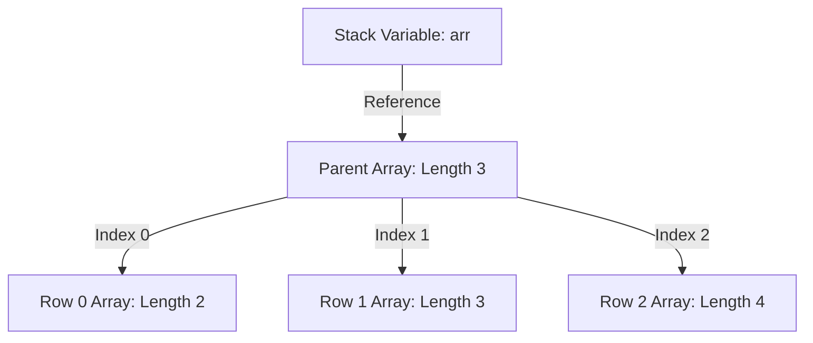

### Types of Arrays & Implementation

```java
// 1. Single-Dimensional Array
int[] scores = {90, 85, 78, 92, 88};

// 2. Jagged Array Example (Rows of varying columns)
int[][] jaggedMatrix = new int[3][];
jaggedMatrix[0] = new int[]{1, 2};
jaggedMatrix[1] = new int[]{3, 4, 5};
jaggedMatrix[2] = new int[]{6, 7, 8, 9};

// 3. Array of Objects
class Car {
    String model;
    Car(String m) { this.model = m; }
}
Car[] garage = new Car[2];
garage[0] = new Car("Tesla");
garage[1] = new Car("Ford");
```

---

## 🔡 Strings

### Definition & Immutability
A `String` represents a sequence of characters. In Java, String is a final class in the `java.lang` package, and all String objects are **immutable** (cannot be modified once created).

#### Why is String Immutable in Java?
1. **String Pool Caching:** Different string reference variables can point to the same string literal in the String Pool, saving memory. If Strings were mutable, changing the value of one reference would silently corrupt all other variables pointing to that same value.
2. **Security:** Strings are widely used as database connection URLs, usernames, passwords, and file paths. If mutable, these values could be dynamically altered outside the application's security checks.
3. **Thread Safety:** Immutability automatically guarantees thread safety, as multiple threads can read the same string without synchronization conflicts.
4. **Caching Hashcode:** Since strings cannot change, their hashcode value is calculated once and cached, making them extremely fast key objects for HashMaps.

### The String Constant Pool (SCP)
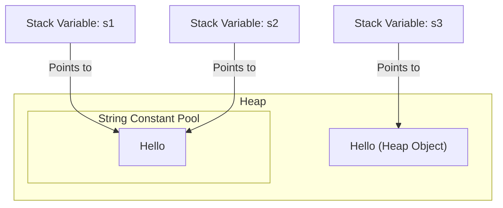

* When you declare a string literal: `String s1 = "Hello";`, Java checks the String Constant Pool. If it exists, `s1` points to it. If not, it is created.
* When you declare using `new`: `String s3 = new String("Hello");`, Java bypasses the SCP check (unless interned) and allocates a new String object on the standard heap.

```java
String s1 = "Hello";
String s2 = "Hello";
String s3 = new String("Hello");

System.out.println(s1 == s2); // true (same reference in String Pool)
System.out.println(s1 == s3); // false (different objects: Pool vs Heap)
System.out.println(s1.equals(s3)); // true (contents are identical)

// String Interning manually forces a Heap String to point to the SCP
String s4 = s3.intern();
System.out.println(s1 == s4); // true
```

---

### 📝 String vs. StringBuilder vs. StringBuffer

| Feature | String | StringBuilder | StringBuffer |
| :--- | :--- | :--- | :--- |
| **Mutability** | ❌ Immutable |  Mutable |  Mutable |
| **Thread Safety** |  Yes (automatic) | ❌ No |  Yes (synchronized methods) |
| **Performance** | Fast for read-only | Very Fast | Slower (locks overhead) |
| **Storage Area** | String Constant Pool / Heap | Standard Heap | Standard Heap |

```java
// StringBuilder - best for fast single-threaded string manipulations
StringBuilder builder = new StringBuilder("Java");
builder.append(" Full Stack");
System.out.println(builder.toString()); // "Java Full Stack"
```

sb.append(", World");          // "Hello, World"
sb.insert(5, " Java");         // "Hello Java, World"
sb.delete(5, 10);              // "Hello, World"
sb.reverse();                  // "dlroW ,olleH"
sb.replace(0, 5, "Hi");        // Replace index 0-5
System.out.println(sb.length()); // Length
System.out.println(sb.toString()); // Convert to String

// StringBuilder — Faster (single-threaded)
StringBuilder sb2 = new StringBuilder();
sb2.append("Java ");
sb2.append("is ");
sb2.append("awesome!");
System.out.println(sb2.toString());  // "Java is awesome!"
sb2.deleteCharAt(4);           // Remove char at index 4
sb2.setCharAt(0, 'j');         // Replace char at index 0
```

---

## 🏛️ OOP — Object Oriented Programming

### 🔄 OOP vs POP

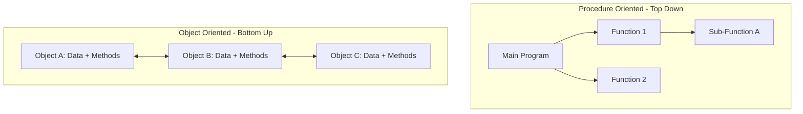

| Topic | POP (Procedure Oriented) | OOP (Object Oriented) |
| :--- | :--- | :--- |
| **Approach** | Top-down design | Bottom-up design |
| **Focus** | Functions / Algorithms | Data / Object entities |
| **Data Flow** | Data flows globally between functions | Data encapsulated within objects |
| **Security** | Low security (global variables) | High security (access specifiers/data hiding) |
| **Reusability** | Difficult; functions tightly coupled | High reusability (via class Inheritance) |
| **Examples** | C, Pascal, COBOL | Java, C++, Python |

**Four Pillars of OOP:**
1. **Encapsulation:** Wrapping attributes and methods together, protecting state via private visibility and public getters/setters.
2. **Abstraction:** Expressing only essential behaviors and operations, hiding internal implementation details using abstract classes and interfaces.
3. **Inheritance:** Enabling hierarchical class designs to reuse common code patterns via `extends` and `implements`.
4. **Polymorphism:** Adapting multiple implementations under a common method/interface name via overloading (static) and overriding (dynamic).

---

### 🏗️ Classes & Objects

* **Class:** A logical template/blueprint containing field attributes and method behaviors. It consumes no physical memory space.
* **Object:** A physical instance of a class allocated on the **heap** using the `new` keyword.

#### Memory allocation of Objects
When `Car myCar = new Car();` is executed:
1. `new Car()` allocates space on the heap for all instance variables.
2. The `Car()` constructor initializes the memory fields.
3. The reference variable `myCar` is created on the execution stack and is assigned the memory address of the heap object.

---

### 🔐 Access Specifiers (Visibility Modes)

Access specifiers control the visibility of classes, constructors, methods, and variables.

| Modifier | Same Class | Same Package | Subclass (diff package) | World (diff package) |
| :--- | :---: | :---: | :---: | :---: |
| **private** |  Yes | ❌ No | ❌ No | ❌ No |
| **default** (no modifier) |  Yes |  Yes | ❌ No | ❌ No |
| **protected** |  Yes |  Yes |  Yes | ❌ No |
| **public** |  Yes |  Yes |  Yes |  Yes |

---

### 🏗️ Constructors & Constructor Chaining

#### Definition & Purpose
A constructor is a special, non-static member method used to initialize a newly created object. It has no return type (not even `void`) and bears the exact name of the declaring class.

#### Constructor Chaining
Constructor chaining is the process of calling one constructor from another constructor in the same class (using `this()`) or parent class (using `super()`). `this()` or `super()` must be the very first line of any constructor method.

#### Constructor Execution flow:
```mermaid
graph TD
    Start[new SubClass()] --> SubParam[SubClass Parameterized Constructor]
    SubParam -->|super() call| ParentParam[Parent Parameterized Constructor]
    ParentParam -->|implicit super()| ObjectConstructor[java.lang.Object Constructor]
    ObjectConstructor --> ParentInit[Parent instance fields & block initialization]
    ParentInit --> SubInit[SubClass instance fields & block initialization]
    SubInit --> End[Execution Completes]
```

```java
class Parent {
    Parent() {
        System.out.println("Parent Constructor Called");
    }
}

class Child extends Parent {
    Child() {
        super(); // Implicitly added by compiler if omitted
        System.out.println("Child Constructor Called");
    }
}
```


---

### ⚙️ Methods

> A **Method** is a block of code that performs a specific task. It is called explicitly and has a return type.

```java
class MethodDemo {

    // 1. INSTANCE METHOD — requires object to call
    void greet() {
        System.out.println("Hello from instance method!");
    }

    // 2. STATIC METHOD — called with class name, no object needed
    static void staticHello() {
        System.out.println("Hello from static method!");
    }

    // 3. METHOD WITH PARAMETERS and RETURN TYPE
    int add(int a, int b) {
        return a + b;
    }

    // 4. VOID METHOD (no return value)
    void printInfo(String name, int age) {
        System.out.println(name + " is " + age + " years old");
    }

    // 5. METHOD OVERLOADING (same name, different parameters)
    int multiply(int a, int b)          { return a * b; }
    double multiply(double a, double b) { return a * b; }
    int multiply(int a, int b, int c)   { return a * b * c; }

    // 6. VARARGS METHOD (variable number of arguments)
    int sum(int... numbers) {
        int total = 0;
        for (int n : numbers) total += n;
        return total;
    }
}

public class Main {
    public static void main(String[] args) {
        MethodDemo obj = new MethodDemo();
        obj.greet();                         // instance call
        MethodDemo.staticHello();            // static call
        System.out.println(obj.add(5, 3));  // 8
        System.out.println(obj.sum(1, 2, 3, 4, 5)); // 15 (varargs)
    }
}
```

---

### 🔒 Encapsulation

* **Definition:** Encapsulation is the process of binding variable states (data fields) and behaviors (methods) together inside a single structural unit (class), while protecting object internals from unauthorized direct access.
* **Why it exists:** Without encapsulation, external code can freely modify internal states to invalid values (e.g., setting a bank balance to a negative number).
* **Implementation (Data Hiding):** Declare variables as `private` and provide validation logic inside `public` getter and setter methods.

```java
class BankAccount {
    private String owner;
    private double balance;

    public BankAccount(String owner, double initialBalance) {
        this.owner = owner;
        this.balance = (initialBalance >= 0) ? initialBalance : 0;
    }

    public double getBalance() {
        return this.balance;
    }

    public void deposit(double amount) {
        if (amount > 0) {
            balance += amount;
            System.out.println("Deposited: " + amount);
        }
    }
}
```

---

### 🧬 Inheritance

* **Definition:** A design paradigm where a subclass (child) acquires members, states, and behaviors of an existing superclass (parent), modeling an **IS-A** relationship.
* **Benefits:** Extreme code reuse and polymorphic subtype behavior.

#### Types of Inheritance Structures

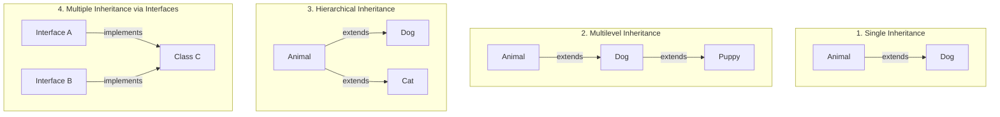

> [!IMPORTANT]
> **Why doesn't Java support multiple class inheritance?**
> To avoid the **Diamond Problem**. If Class A has a method `execute()`, and Class B and C both inherit from A and override `execute()`, a subclass D extending both B and C would not know which version of `execute()` to execute. Java resolves this by allowing multiple inheritance *only* through Interfaces (where implementation details were historically absent).

---

### 🎭 Polymorphism

* **Definition:** Polymorphism (meaning "many forms") is the ability of a single interface or parent reference to invoke different underlying class implementations.

#### Compile-Time vs. Run-Time Polymorphism

| Feature | Compile-Time (Static) | Run-Time (Dynamic) |
| :--- | :--- | :--- |
| **Mechanism** | Method Overloading | Method Overriding |
| **Resolution** | Resolved during compilation | Resolved at execution runtime |
| **Binding Type** | Early Binding | Late / Dynamic Binding |
| **Performance** | Faster (no runtime lookup overhead) | Slightly slower (lookup in Virtual Method Table) |

#### Internal Working of Dynamic Method Dispatch
When a subclass overrides a parent method, the JVM looks up the target method implementation at runtime using a **Virtual Method Table (VMT)** associated with the concrete instance. This runtime resolution is called **Dynamic Method Dispatch**.

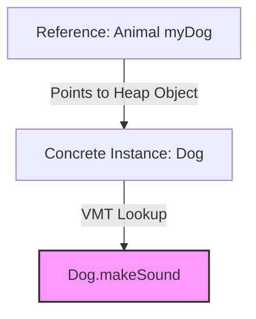

```java
class Animal {
    void makeSound() { System.out.println("Generic animal sound"); }
}

class Dog extends Animal {
    @Override
    void makeSound() { System.out.println("Woof Woof"); }
}

public class DispatchDemo {
    public static void main(String[] args) {
        Animal myAnimal = new Dog(); // Upcasting
        myAnimal.makeSound();        // Prints "Woof Woof" at runtime (Dynamic Dispatch)
    }
}
```

**`super` keyword** — accesses parent class members:
```java
class Vehicle {
    String type = "Vehicle";
    void display() { System.out.println("I am a " + type); }
}

class Car extends Vehicle {
    String type = "Car";

    void display() {
        System.out.println("I am a " + type);            // Car's type
        System.out.println("Parent: " + super.type);     // Vehicle's type
        super.display();                                   // Parent's method
    }
}
```

---

### 🎭 Polymorphism

> **Polymorphism** (Greek: *poly* = many, *morphism* = forms) — The ability of an object to take **many forms**.
> One interface, multiple implementations.

### Types of Polymorphism

| Compile-Time Polymorphism (Static) | Run-Time Polymorphism (Dynamic) |
| :--- | :--- |
| **Method Overloading** | **Method Overriding** |
| Same method name with different parameters/signatures. | Same method name and parameter signature in subclass. |
| Resolved at Compile Time. | Resolved at Run Time. |
| Handled by compiler. | Handled by Java Virtual Machine (JVM). |
| Dynamic binding is not required. | Employs Dynamic Method Dispatch. |


```java
// 1. COMPILE-TIME POLYMORPHISM — Method Overloading
class Calculator {
    int add(int a, int b)             { return a + b; }
    double add(double a, double b)    { return a + b; }
    int add(int a, int b, int c)      { return a + b + c; }
    String add(String a, String b)    { return a + b; }
}

Calculator calc = new Calculator();
System.out.println(calc.add(5, 3));           // 8
System.out.println(calc.add(5.5, 2.2));      // 7.7
System.out.println(calc.add(1, 2, 3));       // 6
System.out.println(calc.add("Hi", " Java")); // "Hi Java"

// 2. RUN-TIME POLYMORPHISM — Method Overriding
class Shape {
    void draw() { System.out.println("Drawing a shape"); }
}

class Circle extends Shape {
    @Override
    void draw() { System.out.println("Drawing a Circle"); }
}

class Rectangle extends Shape {
    @Override
    void draw() { System.out.println("Drawing a Rectangle"); }
}

// Dynamic Method Dispatch (Runtime Polymorphism)
public class Main {
    public static void main(String[] args) {
        Shape s;

        s = new Circle();     // Shape reference, Circle object
        s.draw();             // "Drawing a Circle" — decided at RUNTIME

        s = new Rectangle();
        s.draw();             // "Drawing a Rectangle"
    }
}
```

**Upcasting & Downcasting:**
```java
Animal animal = new Dog();   // Upcasting (implicit) — Dog IS-A Animal
Dog dog = (Dog) animal;      // Downcasting (explicit cast)

// Safe downcasting with instanceof
if (animal instanceof Dog) {
    Dog d = (Dog) animal;
    d.bark();
}
```

---

### 🎭 Abstraction

* **Definition:** Abstraction is the programming practice of hiding internal design and implementation complexities, displaying only the essential operational features of an object.
* **Why it exists:** It decouples interface contracts from concrete implementations, allowing developers to swap underlying components seamlessly without breaking dependent services.

#### Abstraction Channels in Java
1. **Abstract Class (Partial Abstraction):** A template class declared with the `abstract` keyword. It can declare both concrete (implemented) and abstract (unimplemented) methods, allowing common state fields and constructor chains.
2. **Interface (Complete Abstract Contract):** A structural type that defines a contract of behavior. Since Java 8/9, interfaces also support `default`, `static`, and `private` methods.

```java
// Abstract Class Template
abstract class PaymentProcessor {
    protected double processingFee = 2.5;

    // Abstract method (no body)
    abstract void processPayment(double amount);

    // Concrete method (shared behavior)
    void printReceipt(double amount) {
        System.out.println("Receipt printed for: $" + amount);
    }
}

class PayPalProcessor extends PaymentProcessor {
    @Override
    void processPayment(double amount) {
        System.out.println("Processing PayPal payment of $" + (amount + processingFee));
    }
}
```

---

### 🔌 Interfaces & Modern Evolution

An **Interface** defines a behavioral contract that concrete classes agree to implement.

#### Interface Inheritance Relationships
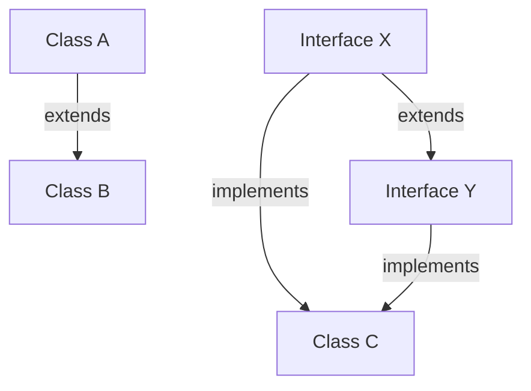

* **Class to Class:** `extends` (Single Inheritance)
* **Class to Interface:** `implements` (Multiple Inheritance)
* **Interface to Interface:** `extends` (Multiple Inheritance)

#### Java 8/9 Interface Enhancements
* **Default Methods (Java 8):** Allow adding new methods to interfaces without breaking existing implementing classes.
* **Static Methods (Java 8):** Utility methods belonging to the interface namespace itself, not instances.
* **Private Methods (Java 9):** Used to share common helper logic between default methods inside the same interface.

```java
interface DBConnector {
    void executeQuery(String sql); // Abstract method

    // Default method (Java 8+)
    default void logQuery(String sql) {
        printLog("Executing: " + sql); // Calls private helper
    }

    // Static helper method (Java 8+)
    static void printStatus() {
        System.out.println("Database connector active.");
    }

    // Private helper method (Java 9+)
    private void printLog(String message) {
        System.out.println("[DB-LOG] " + message);
    }
}
```

#### Types of Interfaces
* **Normal Interface:** Declares multiple abstract behavior methods.
* **Functional Interface (SAM):** Declares exactly one abstract method. Eligible for Lambda Expressions and marked with `@FunctionalInterface`.
* **Marker Interface:** Empty interface with no declared variables or methods. Used to tag runtime properties (e.g. `java.io.Serializable`, `java.lang.Cloneable`).

---

### Abstract Class vs. Interface Comparison

| Characteristic | Abstract Class | Interface |
| :--- | :--- | :--- |
| **Inheritance** | Single class inheritance (`extends`). | Multiple inheritance support (`implements`). |
| **State Fields** | Can declare instance fields (non-static, mutable). | Fields are implicitly `public static final` constants. |
| **Methods** | Can have constructors, final/static/concrete methods. | No constructors. Abstract, `default`, `static`, or `private` only. |
| **Performance** | Slightly faster (direct invocation). | Slightly slower due to virtual table interface lookups. |
| **Core Intent** | Models **IS-A** inheritance & shared class code. | Models **CAN-DO** capability contracts. |
| **Access Specifiers** | Full access control (private, protected, etc.). | Fields and abstract methods are implicitly `public`. |
| **Abstraction Level** | 0% to 100% abstraction. | 100% abstract contract design. |


---

### ⚡ Static Keyword

* **Definition:** The `static` keyword in Java is used for memory management. It indicates that the annotated member belongs to the **type itself** rather than instance objects.
* **Static Member Types:**
  1. **Static Variables:** Single memory allocation in the JVM Method Area shared by all object instances.
  2. **Static Methods:** Callable directly on the class name (e.g. `Math.sqrt()`). Static methods cannot access instance variables or invoke `this` or `super` references.
  3. **Static Block:** Executed once when the class is first loaded into memory by the ClassLoader.
  4. **Static Inner Classes:** Nested classes that do not require an outer class instance reference.

```java
class StaticDemo {
    static int sharedCounter = 0; // Static variable
    int instanceValue = 10;       // Instance variable

    // Static block
    static {
        System.out.println("StaticDemo class loaded!");
    }

    // Static method
    static void incrementCounter() {
        sharedCounter++;
        // System.out.println(instanceValue); // COMPILE ERROR: Cannot access non-static instance variable
    }
}
```

---

### 🔑 this & super Keywords

* **`this`:** Represents the current active instance object reference. Used to resolve variable shadowing or chain local class constructors.
* **`super`:** Represents the immediate parent object instance. Used to invoke parent methods or delegate to parent class constructors.

```java
class Base {
    int id = 100;
    Base(String msg) { System.out.println("Base message: " + msg); }
}

class Derived extends Base {
    int id = 200; // Variable Shadowing

    Derived() {
        super("Calling Base"); // Must be the first statement
        System.out.println("Derived ID: " + this.id);   // 200
        System.out.println("Parent ID: " + super.id); // 100
    }
}
```

---


## 📊 Enum

> **Enum (Enumeration)** is a special class that represents a group of **named constants**.

```java
// Basic Enum
enum Day {
    MONDAY, TUESDAY, WEDNESDAY, THURSDAY, FRIDAY, SATURDAY, SUNDAY
}

// Enum with fields and methods
enum Season {
    SPRING("Warm"), SUMMER("Hot"), AUTUMN("Cool"), WINTER("Cold");

    private final String description;

    Season(String desc) {
        this.description = desc;
    }

    public String getDescription() { return description; }
}

// Usage
Day today = Day.WEDNESDAY;
System.out.println(today);             // WEDNESDAY
System.out.println(today.ordinal());  // 2 (0-indexed position)
System.out.println(today.name());     // "WEDNESDAY"

// Enum in switch
switch (today) {
    case MONDAY:    System.out.println("Start of week!"); break;
    case FRIDAY:    System.out.println("Almost weekend!"); break;
    case SATURDAY:
    case SUNDAY:    System.out.println("Weekend!"); break;
    default:        System.out.println("Midweek");
}

// Get all enum values
for (Day d : Day.values()) {
    System.out.println(d.ordinal() + ": " + d);
}

System.out.println(Season.SUMMER.getDescription());  // "Hot"
```

---

## 🏷️ Annotations

> **Annotations** are metadata that provide information about the code to the compiler, JVM, or frameworks.

```
Why use Annotations?
  Provide metadata to compiler (suppress warnings)
  Instructions to build tools (Maven, Gradle)
  Runtime behavior (frameworks like Spring, JUnit)
  Code documentation
```

```
┌──────────────────────────────────────────────────────────────────────────────┐
│                       COMMON JAVA ANNOTATIONS                                │
├─────────────────────────────┬─────────────────────────────────────────────── │
│ Annotation                  │ Description                                    │
├─────────────────────────────┼─────────────────────────────────────────────── │
│ @Override                   │ Tells compiler this method overrides a parent  │
│ @Deprecated                 │ Marks element as outdated; compiler warns      │
│ @SuppressWarnings           │ Suppresses specific compiler warnings          │
│ @FunctionalInterface        │ Marks interface as functional (SAM)            │
│ @SafeVarargs                │ Suppresses varargs safety warnings             │
└─────────────────────────────┴─────────────────────────────────────────────── ┘
```

```java
class Parent {
    void greet() { System.out.println("Hello from Parent"); }
}

class Child extends Parent {
    @Override               // tells compiler: I am overriding a parent method
    void greet() {
        System.out.println("Hello from Child");
    }

    @Deprecated             // marks this as old/outdated
    void oldMethod() {
        System.out.println("This is deprecated, use newMethod() instead");
    }

    @SuppressWarnings("unchecked")   // suppresses unchecked cast warning
    void aMethod() {
        java.util.List list = new java.util.ArrayList();
        list.add("item");
    }
}

@FunctionalInterface
interface MyFunc {
    void execute();   // single abstract method
}
```

---

## 🔄 Functional Interface & Lambda Expressions

### Lambda Expression
* **Definition:** A Lambda Expression is a lightweight, anonymous (nameless) function implementation containing parameters, an arrow operator (`->`), and a statement or expression block.
* **Why it exists:** Introduced in Java 8 to bring Functional Programming paradigms to the language, enabling clean, declarative code patterns (such as block streams and inline listeners) without creating verbose anonymous inner classes.

```java
// Traditional Anonymous Class
Runnable r1 = new Runnable() {
    @Override
    public void run() { System.out.println("Thread running!"); }
};

// Modern Lambda Expression
Runnable r2 = () -> System.out.println("Thread running!");
```

---

## ⚠️ Exception Handling

### Definition & Flow Control
An exception is an unwanted or unexpected event that occurs during program execution and disrupts the normal flow of program instructions.

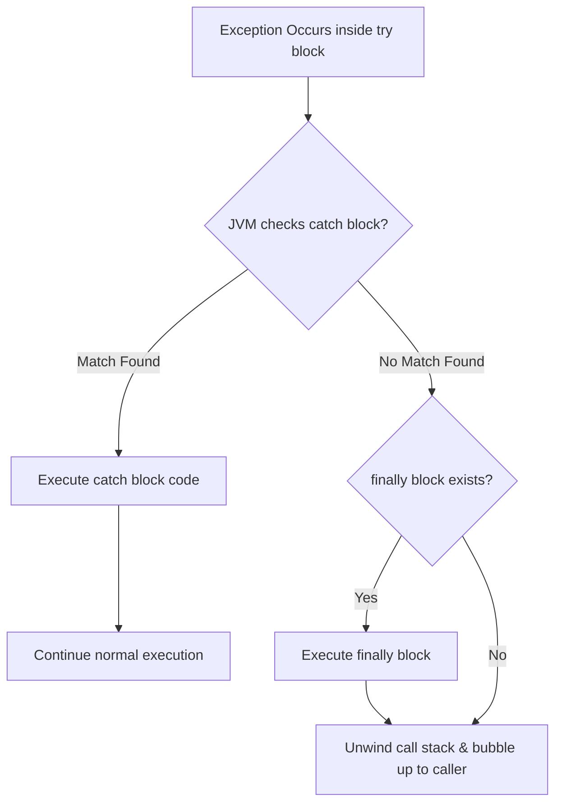

### Checked vs. Unchecked Exceptions

| Feature | Checked Exceptions | Unchecked Exceptions (Runtime) |
| :--- | :--- | :--- |
| **Compiler Check** | Checked at compile-time. Code will not compile unless handled/declared. | Ignored by the compiler at compile-time. |
| **Parent Class** | Extends `java.lang.Exception` directly. | Extends `java.lang.RuntimeException`. |
| **Typical Cause** | External environment failures (missing file, network down). | Program logic errors (null reference, array out of bounds). |
| **Example Classes**| `IOException`, `SQLException`, `ClassNotFoundException` | `NullPointerException`, `ArithmeticException` |

---

### Modern Try-With-Resources (Java 7+)
Before Java 7, resource cleanup (like closing files or database connections) was manually written inside a `finally` block, which was verbose and prone to exceptions leaking. Java 7 introduced **Try-With-Resources** to automatically close any resource implementing `java.lang.AutoCloseable`.

```java
// Resources are automatically closed at the end of the block
try (FileReader fr = new FileReader("input.txt");
     BufferedReader br = new BufferedReader(fr)) {
    System.out.println(br.readLine());
} catch (IOException e) {
    System.out.println("File error: " + e.getMessage());
}
```

---

### Custom Exceptions
You can create custom exceptions by extending `Exception` (for checked exceptions) or `RuntimeException` (for unchecked exceptions).

```java
// Custom Checked Exception
class InsufficientFundsException extends Exception {
    private double deficit;

    public InsufficientFundsException(double deficit) {
        super("Transaction failed! Deficit amount: $" + deficit);
        this.deficit = deficit;
    }
}
```

    }

    double getAmount() { return amount; }
}

// try-with-resources (Java 7+) — auto-closes resources
try (java.io.FileReader fr    = new java.io.FileReader("file.txt");
     java.io.BufferedReader br = new java.io.BufferedReader(fr)) {
    String line;
    while ((line = br.readLine()) != null) {
        System.out.println(line);
    }
} catch (java.io.IOException e) {
    e.printStackTrace();
}   // fr and br are automatically closed here!
```

---

## 🧵 Multithreading

* **Definition:** Multithreading is a Java feature that allows concurrent execution of two or more parts of a program (threads) to maximize CPU utilization.

### Thread Lifecycle (States) & Transitions

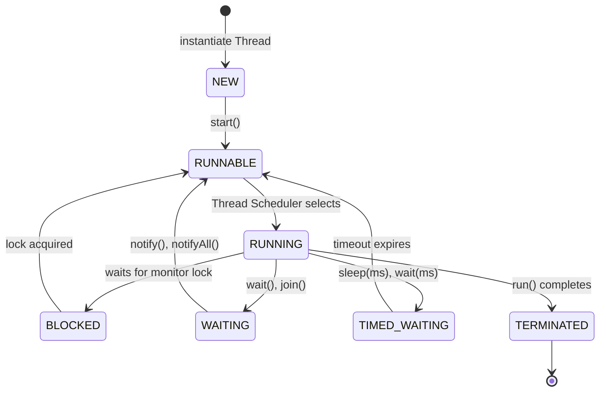

### Thread Synchronization & Race Conditions
When multiple threads access shared, mutable memory states concurrently, data corruption can occur (a **Race Condition**). Java resolves this using **Locks (Monitors)**:
* **Synchronized Method:** Locks the calling object instance (`this`).
* **Synchronized Block:** Locks a specific target resource, offering finer-grained concurrency control.

```java
class Account {
    private double balance = 1000;

    // Intrinsic lock prevents concurrent balance deduction corruption
    public synchronized void withdraw(double amount) {
        if (balance >= amount) {
            balance -= amount;
        }
    }
}
```

---

## 📦 Packages

* **Definition:** A package is a namespace namespace that organizes a set of related classes, interfaces, and sub-packages in a directory structure.
* **Why it exists:** Packages prevent naming conflicts (e.g. you can have two classes named `User` as long as they are in different packages) and control access using visibility modifiers (like package-private default visibility).

```
com/
└── asfin/
    └── myapp/
        ├── model/
        │   └── Student.java
        └── Main.java
```

```java
package com.asfin.myapp; // Must be the first line

import java.util.ArrayList; // Single class import
import java.util.*;        // Package import wildcard
```

---

## 🖼️ Java Swing & GUI


Java Swing is a lightweight, platform-independent GUI toolkit built on top of the Abstract Window Toolkit (AWT).

### MVC (Model-View-Controller) Architecture in GUI
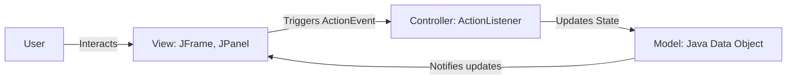

* **Model:** Holds the application data state and structural business rules (no Swing classes).
* **View:** Draws components on screen (`JButton`, `JLabel`). Delegates interaction inputs.
* **Controller:** Integrates both. Interprets actions (like mouse clicks) and instructs Model updates.

---

## 🗂️ File I/O (Input & Output Streams)

### Stream Categories
All Java I/O operations process sequential pipelines of data called streams.

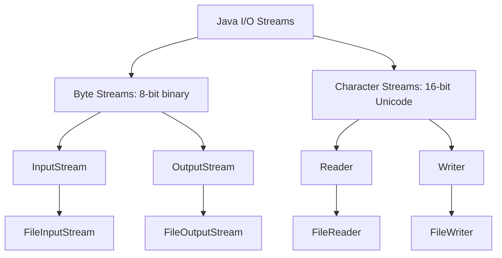


```java
import java.io.*;

public class FileIODemo {
    public static void main(String[] args) {
        // --- WRITING to a File ---
        try (FileWriter fw = new FileWriter("output.txt");
             BufferedWriter bw = new BufferedWriter(fw)) {

            bw.write("Hello, World!");
            bw.newLine();
            bw.write("Java File I/O is easy!");

        } catch (IOException e) {
            e.printStackTrace();
        }

        // --- READING from a File ---
        try (FileReader fr = new FileReader("output.txt");
             BufferedReader br = new BufferedReader(fr)) {

            String line;
            while ((line = br.readLine()) != null) {
                System.out.println(line);
            }

        } catch (IOException e) {
            e.printStackTrace();
        }

        // --- File operations with java.io.File ---
        File file = new File("output.txt");
        System.out.println("Exists: "    + file.exists());
        System.out.println("Name: "      + file.getName());
        System.out.println("Path: "      + file.getAbsolutePath());
        System.out.println("Size: "      + file.length() + " bytes");
        System.out.println("Is File: "   + file.isFile());
        System.out.println("Is Dir: "    + file.isDirectory());

        // Create directory
        File dir = new File("myFolder");
        dir.mkdir();
    }
}
```

---

## 🔄 Serialization & Deserialization

> **Serialization** — Converting a Java object into a **byte stream** (for storing/sending).
> **Deserialization** — Reconstructing the Java object from a **byte stream**.
> Class must implement `java.io.Serializable` (a Marker Interface).

```
Object → (Serialization) → Byte Stream → (Deserialization) → Object
  RAM                        File/Network                      RAM
```

```java
import java.io.*;

// Must implement Serializable
class Person implements Serializable {
    private static final long serialVersionUID = 1L;  // version control
    String name;
    int age;
    transient String password;  // 'transient' — NOT serialized

    Person(String n, int a, String p) {
        name = n; age = a; password = p;
    }
}

public class SerializationDemo {
    public static void main(String[] args) throws IOException, ClassNotFoundException {
        Person p = new Person("Asfin", 20, "secret123");

        // SERIALIZATION — save object to file
        try (ObjectOutputStream oos = new ObjectOutputStream(new FileOutputStream("person.ser"))) {
            oos.writeObject(p);
            System.out.println("Object serialized!");
        }

        // DESERIALIZATION — read object from file
        try (ObjectInputStream ois = new ObjectInputStream(new FileInputStream("person.ser"))) {
            Person p2 = (Person) ois.readObject();
            System.out.println("Name: " + p2.name);        // "Asfin"
            System.out.println("Age: "  + p2.age);         // 20
            System.out.println("Password: " + p2.password); // null (transient!)
        }
    }
}
```

---

## 📚 Collections API

The Collections Framework provides unified architecture classes to manage and store groups of objects.

### Collections Hierarchy

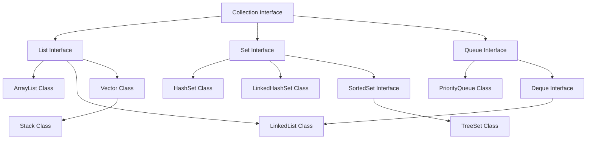

### Map Hierarchy

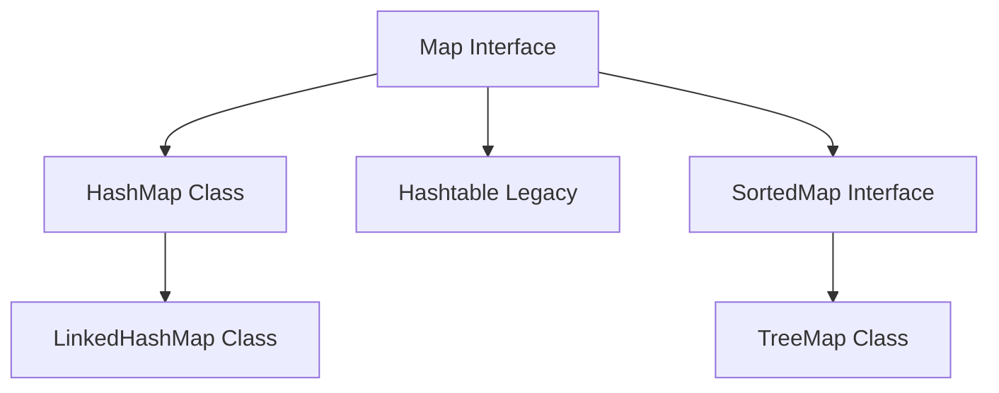

### Comparison Tables

#### ArrayList vs. LinkedList vs. Vector
| Characteristic | ArrayList | LinkedList | Vector |
| :--- | :--- | :--- | :--- |
| **Data Structure** | Dynamic resizable array | Doubly-linked list | Dynamic array (synchronized) |
| **Search (Get)** | O(1) (Direct index lookup) | O(N) (Iterates nodes) | O(1) |
| **Insert / Delete**| O(N) (Requires element shifts) | O(1) (Node pointer updates) | O(N) |
| **Thread Safety** | ❌ No | ❌ No |  Yes (slow synchronized) |

#### HashMap vs. TreeMap vs. LinkedHashMap
| Characteristic | HashMap | TreeMap | LinkedHashMap |
| :--- | :--- | :--- | :--- |
| **Iteration Order** | ❌ Unordered |  Sorted (natural or comparator) |  Insertion order |
| **Data Structure** | Hash Table (Node Buckets) | Red-Black Tree | Double-Linked Hash Table |
| **Search Time** | O(1) average | O(log N) | O(1) |
| **Null Keys/Values**| Allows 1 null key, many null values | ❌ No null keys allowed | Allows 1 null key, many null values |

```java
import java.util.*;

public class CollectionsDemo {
    public static void main(String[] args) {
        // List - ordered, permits duplicates
        List<String> list = new ArrayList<>();
        list.add("Apple"); list.add("Banana"); list.add("Apple");
        System.out.println("List: " + list);

        // Set - unique elements
        Set<String> set = new HashSet<>();
        set.add("Java"); set.add("Python"); set.add("Java");
        System.out.println("Set: " + set);

        // Map - key-value pairs
        Map<String, Integer> map = new HashMap<>();
        map.put("Alice", 90);
        map.put("Bob", 85);
        System.out.println("Map: " + map);
    }
}
```

---

## 🌊 Stream API

* **Definition:** Stream API (introduced in Java 8) processes pipeline operations on sequences of elements in a functional style. Streams do not store elements; they carry values from source collections through pipelined stages.

```java
import java.util.*;
import java.util.stream.*;

public class StreamDemo {
    public static void main(String[] args) {
        List<Integer> numbers = Arrays.asList(1, 2, 3, 4, 5, 6, 7, 8, 9, 10);

        // filter & map pipeline
        List<Integer> squares = numbers.stream()
                                       .filter(n -> n % 2 == 0)
                                       .map(n -> n * n)
                                       .collect(Collectors.toList());
        System.out.println("Even Squares: " + squares); // [4, 16, 36, 64, 100]
    }
}
```

---

## 🔗 JDBC — Java Database Connectivity

### JDBC Architecture Flow
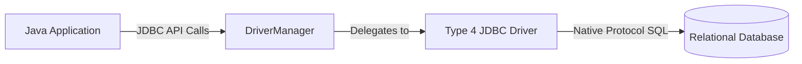

```java
import java.sql.*;

public class JDBCDemo {
    public static void main(String[] args) {
        String url = "jdbc:mysql://localhost:3306/mydb";
        String user = "root", pass = "password";

        try (Connection conn = DriverManager.getConnection(url, user, pass);
             PreparedStatement ps = conn.prepareStatement("SELECT * FROM students WHERE age > ?")) {
            
            ps.setInt(1, 18);
            try (ResultSet rs = ps.executeQuery()) {
                while (rs.next()) {
                    System.out.println(rs.getString("name"));
                }
            }
        } catch (SQLException e) {
            e.printStackTrace();
        }
    }
}
```

---

## 🌐 Servlets & JSP

### Servlet Request Lifecycle
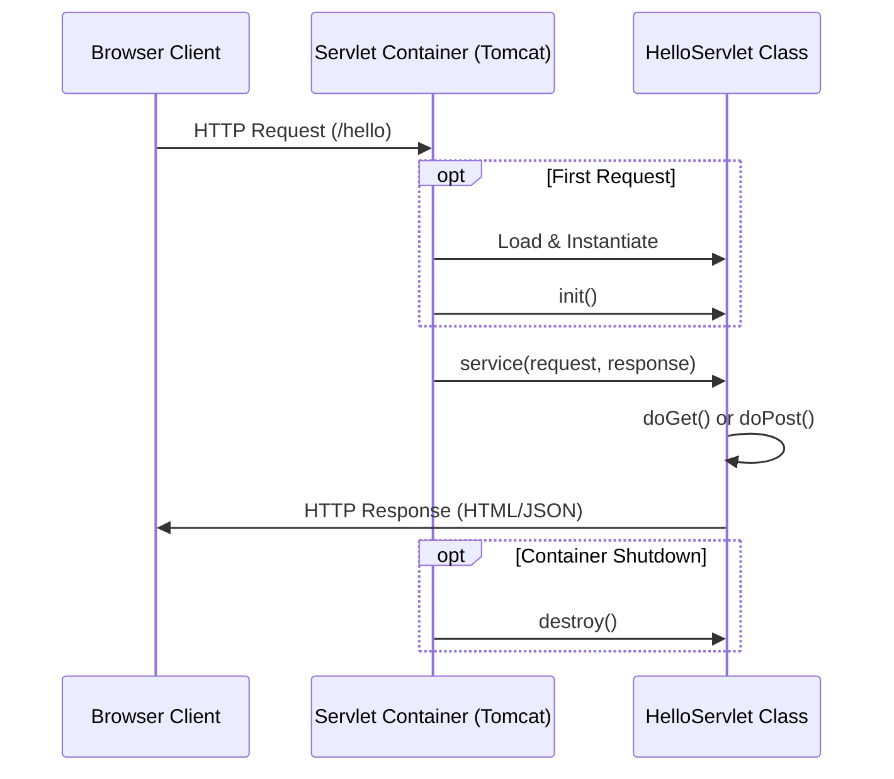

```java
import javax.servlet.*;
import javax.servlet.http.*;
import java.io.*;

@WebServlet("/hello")
public class HelloServlet extends HttpServlet {
    @Override
    protected void doGet(HttpServletRequest req, HttpServletResponse resp) throws IOException {
        resp.setContentType("text/html");
        resp.getWriter().println("<h1>Hello from Servlet!</h1>");
    }
}
```

---

## 🌍 REST API & Web Services

### REST API Architecture Request Flow
```mermaid
graph LR
    Client[Client Browser / Postman] -->|HTTP GET/POST Request| SpringController[REST Controller]
    SpringController -->|Validates & Parses| Service[Service Layer]
    Service -->|Business Logic| Repository[Data Access Layer]
    Repository -->|Returns Entity| Service
    Service -->|Converts to DTO| SpringController
    SpringController -->|Serializes to JSON/XML| Client
```

```java
import org.springframework.web.bind.annotation.*;
import java.util.List;

@RestController
@RequestMapping("/api/students")
public class StudentController {

    @GetMapping
    public List<Student> getAllStudents() {
        return studentService.findAll();
    }

    @GetMapping("/{id}")
    public Student getStudentById(@PathVariable Long id) {
        return studentService.findById(id);
    }

    @PostMapping
    @ResponseStatus(HttpStatus.CREATED)
    public Student createStudent(@RequestBody Student student) {
        return studentService.save(student);
    }

    @PutMapping("/{id}")
    public Student updateStudent(@PathVariable Long id, @RequestBody Student student) {
        return studentService.update(id, student);
    }

    @DeleteMapping("/{id}")
    @ResponseStatus(HttpStatus.NO_CONTENT)
    public void deleteStudent(@PathVariable Long id) {
        studentService.delete(id);
    }
}
```

---

## 🗺️ ORM Tools

* **Definition:** Object-Relational Mapping (ORM) is a technique that maps database tables to Java object entities, abstracting SQL queries into object methods.

### Hibernate / JPA Architecture
```mermaid
graph TD
    App[Java Application] -->|Configures| SF[SessionFactory / EntityManagerFactory]
    SF -->|Opens| Session[Session / EntityManager]
    Session -->|Begins| Tx[Transaction]
    Session -->|Performs CRUD| PersistentObj[Persistent Entities]
    PersistentObj -->|Syncs/Flushes| DB[(Database Connection)]
```

### ORM vs. Raw JDBC Comparison

| Aspect | Without ORM (Raw JDBC) | With ORM (Hibernate / JPA) |
| :--- | :--- | :--- |
| **SQL Writing** | You write all SQL manually. | SQL is auto-generated from annotations. |
| **Code Volume** | Verbose: `setString`, `setInt`, `executeUpdate`… | Concise: `repository.save(entity)` |
| **Mapping** | Manually map `ResultSet` columns to fields. | Auto-mapped via `@Entity`, `@Column` annotations. |
| **Maintainability** | Hard to maintain for large schemas. | Easy to refactor (rename class = rename table). |
| **Performance Control** | Full control over every query. | Less control; requires tuning for complex queries. |

```java
import javax.persistence.*;

// JPA Entity (Hibernate ORM)
@Entity
@Table(name = "students")
public class Student {

    @Id
    @GeneratedValue(strategy = GenerationType.IDENTITY)
    private Long id;

    @Column(name = "student_name", nullable = false)
    private String name;

    @Column(nullable = false)
    private int age;

    @Column(unique = true)
    private String email;

    // Constructors, Getters, Setters...
}

// Spring Data JPA Repository
public interface StudentRepository extends JpaRepository<Student, Long> {
    List<Student> findByName(String name);
    List<Student> findByAgeGreaterThan(int age);
    Optional<Student> findByEmail(String email);
}
```

---

## 📦 Maven

* **Definition:** Apache Maven is a software project management and build automation tool based on the concept of a Project Object Model (POM).

### Maven Build Lifecycle
```mermaid
graph TD
    validate[validate] --> compile[compile]
    compile --> test[test]
    test --> package[package]
    package --> verify[verify]
    verify --> install[install]
    install --> deploy[deploy]
```

```xml
<?xml version="1.0" encoding="UTF-8"?>
<project>
  <modelVersion>4.0.0</modelVersion>
  <groupId>com.asfin</groupId>
  <artifactId>myapp</artifactId>
  <version>1.0.0</version>
  <packaging>jar</packaging>

  <dependencies>
    <dependency>
      <groupId>org.springframework.boot</groupId>
      <artifactId>spring-boot-starter-web</artifactId>
      <version>3.2.0</version>
    </dependency>
  </dependencies>
</project>
```

---

## 🐘 Gradle

* **Definition:** Gradle is a build automation tool that builds on the concepts of Apache Ant and Apache Maven, using a Groovy or Kotlin Domain Specific Language (DSL) instead of XML.

**build.gradle (Groovy DSL):**
```groovy
plugins {
    id 'java'
    id 'org.springframework.boot' version '3.2.0'
}

group = 'com.asfin'
version = '1.0.0'
sourceCompatibility = '21'

repositories {
    mavenCentral()
}

dependencies {
    implementation 'org.springframework.boot:spring-boot-starter-web'
    implementation 'org.springframework.boot:spring-boot-starter-data-jpa'
    runtimeOnly 'com.mysql:mysql-connector-j'
    testImplementation 'org.springframework.boot:spring-boot-starter-test'
}
```

**Gradle Commands:**
```bash
./gradlew clean          # Clean build
./gradlew build          # Compile + test + package
./gradlew test           # Run tests
./gradlew bootRun        # Run Spring Boot app
./gradlew dependencies   # Show dependencies
```

---

## 🧪 JUnit Testing

* **Definition:** JUnit is a unit testing framework for the Java programming language, essential for Test-Driven Development (TDD).

```java
import org.junit.jupiter.api.*;
import static org.junit.jupiter.api.Assertions.*;

class CalculatorTest {

    Calculator calc;

    @BeforeEach         // Runs before each test
    void setUp() {
        calc = new Calculator();
    }

    @AfterEach          // Runs after each test
    void tearDown() {
        calc = null;
    }

    @Test               // Marks method as a test
    void testAdd() {
        assertEquals(8, calc.add(5, 3));         // 5 + 3 = 8
    }

    @Test
    void testDivide() {
        assertEquals(4.0, calc.divide(8, 2));    // 8 / 2 = 4
    }

    @Test
    void testDivideByZero() {
        assertThrows(ArithmeticException.class,
            () -> calc.divide(10, 0));           // Should throw
    }

    @Test
    @Disabled("Not implemented yet")             // Skip this test
    void testMultiply() { }

    @ParameterizedTest
    @ValueSource(ints = {2, 4, 6, 8, 10})
    void testIsEven(int number) {
        assertTrue(number % 2 == 0);
    }
}
```

**JUnit Assertions:**
```java
assertEquals(expected, actual)          // values are equal
assertNotEquals(unexpected, actual)     // values are not equal
assertTrue(condition)                   // condition is true
assertFalse(condition)                  // condition is false
assertNull(object)                      // object is null
assertNotNull(object)                   // object is not null
assertThrows(ExceptionClass, lambda)    // lambda throws exception
assertArrayEquals(expected, actual)     // arrays are equal
```

---

## 📁 Git & Version Control

* **Definition:** Git is a distributed version control system designed to track changes in source code files.

### Git Staging & Branching Workflow
```mermaid
graph LR
    WS[Working Directory] -->|git add| Index[Staging Area]
    Index -->|git commit| Local[Local Repository]
    Local -->|git push| Remote[Remote Repository]
```

```bash
# Initial Setup
git config --global user.name  "Mohammad Asfin"
git config --global user.email "asfin@example.com"

# Start a new repo
git init                         # Initialize empty repo
git clone <url>                  # Clone existing repo

# Daily Workflow
git status                       # Check what's changed
git add .                        # Stage all changes
git add filename.java            # Stage specific file
git commit -m "Add login feature"# Commit with message
git push origin main             # Push to remote (GitHub)
git pull origin main             # Pull latest from remote

# Branching
git branch                       # List branches
git branch feature-login         # Create new branch
git checkout feature-login       # Switch to branch
git checkout -b hotfix           # Create + switch in one step
git merge feature-login          # Merge branch into current
git branch -d feature-login      # Delete merged branch

# Other Useful Commands
git log --oneline                # Compact commit history
git diff                         # Show unstaged changes
git stash                        # Temporarily save changes
git stash pop                    # Restore stashed changes
git reset --soft HEAD~1          # Undo last commit (keep changes)
git reset --hard HEAD~1          # Undo last commit (discard changes)
```

### Git Workflow

`Working Directory` ➡️ `git add` ➡️ `Staging Area` ➡️ `git commit` ➡️ `Local Repo` ➡️ `git push` ➡️ `Remote (GitHub)`

---

## 🏗️ DSA — Data Structures & Algorithms

> **DSA** is the study of organizing and processing data efficiently.

### Data Structures

| Category | Structures | Description |
| :--- | :--- | :--- |
| **Linear** | Array, LinkedList, Stack, Queue | Elements arranged sequentially. |
| **Non-Linear** | Tree, Graph | Elements with hierarchical or network relationships. |
| **Hash-Based** | HashMap, HashSet | Key-based O(1) average-time lookups. |

### Algorithms

| Category | Algorithms |
| :--- | :--- |
| **Sorting** | Bubble Sort, Selection Sort, Insertion Sort, Merge Sort, Quick Sort |
| **Searching** | Linear Search, Binary Search |
| **Graph/Tree Traversal** | DFS (Depth First Search), BFS (Breadth First Search) |
| **Design Paradigms** | Dynamic Programming, Greedy, Divide & Conquer |

```java
// LinkedList implementation
class Node {
    int data;
    Node next;
    Node(int data) { this.data = data; next = null; }
}

class MyLinkedList {
    Node head;

    void addFirst(int data) {
        Node newNode = new Node(data);
        newNode.next = head;
        head = newNode;
    }

    void print() {
        Node curr = head;
        while (curr != null) {
            System.out.print(curr.data + " → ");
            curr = curr.next;
        }
        System.out.println("null");
    }
}

// Stack (LIFO)
Stack<Integer> stack = new Stack<>();
stack.push(1); stack.push(2); stack.push(3);
System.out.println(stack.pop());    // 3 (Last In, First Out)
System.out.println(stack.peek());   // 2 (view top without removing)

// Queue (FIFO)
Queue<String> queue = new LinkedList<>();
queue.offer("Alice"); queue.offer("Bob"); queue.offer("Charlie");
System.out.println(queue.poll());   // "Alice" (First In, First Out)

// Binary Search
int[] sorted = {1, 3, 5, 7, 9, 11, 13};
int target = 7;
int low = 0, high = sorted.length - 1;
while (low <= high) {
    int mid = (low + high) / 2;
    if (sorted[mid] == target) {
        System.out.println("Found at index: " + mid);  // 3
        break;
    } else if (sorted[mid] < target) {
        low = mid + 1;
    } else {
        high = mid - 1;
    }
}
```

---

<div align="center">

## 📊 Quick Reference Summary

| Topic | Key Concept |
|-------|-------------|
| **JDK/JRE/JVM** | JDK = Develop + Run, JRE = Run only, JVM = Executes bytecode |
| **Datatypes** | 8 primitives: byte, short, int, long, float, double, char, boolean |
| **OOP Pillars** | Encapsulation, Abstraction, Inheritance, Polymorphism |
| **Access** | private < default < protected < public |
| **Interface** | implements (class), extends (interface-to-interface) |
| **Lambda** | `(params) -> expression` — requires Functional Interface |
| **Exception** | try-catch-finally, throw, throws, custom exceptions |
| **Threads** | extend Thread OR implement Runnable (preferred) |
| **Collections** | List (ordered), Set (no dups), Map (key-value) |
| **Streams** | filter, map, reduce, collect — functional pipeline |
| **JDBC** | Load Driver → Connect → Statement → Execute → Close |
| **Maven** | pom.xml dependency management, mvn clean install |

---

### Happy Learning Java!

**Author:** Mohammad Asfin &nbsp;|&nbsp; **Version:** 1.0.0 &nbsp;|&nbsp; **Last Updated:** July 2026

[](https://github.com/Mohammad-Asfin)

> *"The best way to learn programming is to write programs."* — Brian Kernighan

</div>
