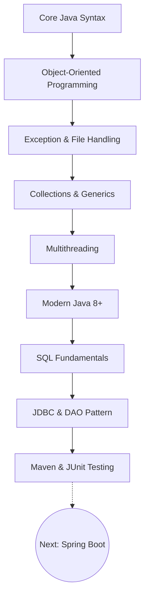

# ☕ Java Backend Developer Roadmap & Repository

Welcome to the **Complete Java Learning Repository**! This repository is carefully structured as a progressive learning roadmap. It is designed to take you from absolute Java basics all the way to advanced Java Backend concepts like JDBC, Maven, JUnit, and the DAO design pattern.

## 🗺️ The Learning Path

Follow the sections in order. Each section builds upon the previous one.

---

## 1️⃣ Core Java Syntax (`2.x` - `8.x`)

### What You'll Learn
The absolute fundamentals of the Java language. How to declare variables, write loops, create basic methods, and handle arrays.

### Topics & Examples
*   [Variables & Data Types](file:///2.5%20variables.java)
*   [Operators (Assignment, Relational, Logical)](file:///2.9%20Assignment%20Operators.java)
*   [Control Statements (If-Else, Switch)](file:///2.12.1%20If%20Else.java)
*   [Loops (While, Do-While, For)](file:///3.4%20For%20Loop.java)
*   [Arrays & Enhanced For Loop](file:///6.7%20Enhanched%20for%20loop.java)
*   [Strings (Mutable vs Immutable)](file:///7.2%20Mutable%20vs%20Immutable%20string.java)

### 💡 Practice Exercises
1. Write a program to reverse a given String.
2. Create an array of 10 numbers and find the maximum and minimum values using an enhanced for-loop.

---

## 2️⃣ Object-Oriented Programming (`9.x` - `17.x`)

### What You'll Learn
The pillars of OOP. How to design your code using classes, objects, inheritance, and interfaces to make it reusable and maintainable.

### Topics & Examples
*   [Classes, Objects & Constructors](file:///9.6%20Constructor.java)
*   [Encapsulation & Getters/Setters](file:///9.1%20Encapsulation.java)
*   [this and super keywords](file:///9.9%20this%20vs%20super%20keyword.java)
*   [Inheritance (Single & Multilevel)](file:///10.4%20Single%20and%20Multilevel%20Inheritance.java)
*   [Polymorphism (Method Overriding & Overloading)](file:///10.9%20Method%20Overriding.java)
*   [Abstraction (Abstract Classes & Interfaces)](file:///14.2%20What%20is%20Interface.java)
*   [Enums & Annotations](file:///15.1%20What%20is%20Enum.java)

### 💡 Practice Exercises
1. Create a base class `Vehicle` and derived classes `Car` and `Bike`. Override a `startEngine()` method.
2. Create an interface `Payable` with a `calculatePayment()` method, and implement it in `Employee` and `Invoice` classes.

---

## 3️⃣ Exception & File Handling (`18.x`, `23.x`)

### What You'll Learn
How to handle runtime errors gracefully so your program doesn't crash, and how to permanently save data to the file system.

### Topics & Examples
*   [Try, Catch, Finally & Custom Exceptions](file:///18.7%20Custom%20Exception.java)
*   [Try-with-resources](file:///18.10%20try%20with%20resources.java)
*   [File Handling (Legacy `java.io`)](file:///23.1%20File%20and%20IO%20Streams.java)
*   [File Handling (Modern `java.nio`)](file:///23.2%20Reading%20Writing%20Files%20NIO.java)

---

## 4️⃣ Collections Framework & Generics (`20.x`, `21.x`)

### What You'll Learn
How to dynamically store, search, and sort groups of objects. You'll learn about Lists, Sets, Maps, and how Generics enforce type safety.

### Topics & Examples
*   [ArrayList vs LinkedList](file:///20.6%20LinkedList%20and%20Queue.java)
*   [HashSet & TreeSet](file:///20.3%20Sets.java)
*   [HashMap vs TreeMap vs LinkedHashMap](file:///20.8%20TreeMap%20and%20LinkedHashMap.java)
*   [PriorityQueue & Deque](file:///20.7%20PriorityQueue%20and%20Deque.java)
*   [Comparable vs Comparator](file:///20.5%20Comparator%20vs%20Comparable.java)
*   [Generics (Classes, Methods, Wildcards)](file:///21.3%20Bounded%20Types%20and%20Wildcards.java)

### 💡 Practice Exercises
1. Store a list of custom `Student` objects in an `ArrayList`.
2. Sort the students by age using a custom `Comparator`.
3. Use a `HashSet` to remove any duplicate students.

---

## 5️⃣ Multithreading (`19.x`)

### What You'll Learn
How to make your application perform multiple tasks at the exact same time (Concurrency) to improve performance.

### Topics & Examples
*   [Thread Lifecycle & Runnable](file:///19.4%20Runnable%20vsThrowable.java)
*   [Race Conditions & Synchronization](file:///19.5%20Race%20Condition.java)
*   [Inter-thread Communication (wait/notify)](file:///19.7%20Wait%20Notify.java)
*   [ExecutorService & Callable](file:///19.8%20ExecutorService%20and%20Callable.java)
*   [Concurrent Collections (ConcurrentHashMap)](file:///19.9%20Concurrent%20Collections.java)

---

## 6️⃣ Modern Java 8+ (`22.x`)

### What You'll Learn
The features introduced in Java 8 that changed how Java is written—making it more functional, concise, and safe.

### Topics & Examples
*   [Lambda Expressions](file:///17.2%20Lambda%20Expression.java)
*   [Stream API (map, filter, reduce)](file:///22.4%20Map%20Filter%20Reduce%20Sorted.java)
*   [Stream Collectors (groupingBy, partitioningBy)](file:///22.9%20Stream%20Collectors.java)
*   [Method References](file:///22.6%20Method%20References.java)
*   [Optional Class (Avoiding NullPointerException)](file:///22.7%20Optional%20Class.java)
*   [Date & Time API (java.time)](file:///22.8%20Date%20and%20Time%20API.java)

### 💡 Practice Exercises
1. Given a list of integers, use Streams to filter out odd numbers and double the even ones.
2. Given a list of `Employee` objects, use `Collectors.groupingBy` to group them by department.

---

## 7️⃣ SQL Fundamentals

### What You'll Learn
The absolute minimum SQL required to interact with databases before jumping into JDBC.

### Topics & Examples
*   [SQL Basics (CREATE, INSERT, SELECT, UPDATE, JOIN)](file:///SQL_Basics/sql_fundamentals.sql)

---

## 8️⃣ JDBC & DAO Mini-Project (Highly Recommended)

### What You'll Learn
How Java applications communicate with relational databases (MySQL/PostgreSQL) and how to architect a backend application properly using the DAO pattern.

### The Learning Path
1.  **[Connecting Java and DB](file:///Connecting%20Java%20and%20DB/)**: The standard 7-step JDBC workflow.
2.  **[JDBC CRUD Operations](file:///Crud%20operations/)**: Basic Statement inserts and deletes.
3.  **[PreparedStatement](file:///PreparedStatement/)**: Using `?` parameters to prevent SQL injection.
4.  **[JDBC Try-With-Resources](file:///JDBC_Try_With_Resources/)**: The modern, safe way to auto-close connections.
5.  **[JDBC Transactions](file:///JDBC_Transactions/)**: How to `commit()` and `rollback()` safely.
6.  **[JDBC Batch Processing](file:///JDBC_BatchProcessing/)**: Bulk inserting records for high performance.
7.  **[JDBC CallableStatement](file:///JDBC_CallableStatement/)**: Interacting with stored procedures.
8.  **🏆 [JDBC Student Management (DAO Mini-Project)](file:///JDBC_Student_Management/)**: A complete console application putting it all together!

### 💡 Practice Exercises
1. Open the `JDBC_Student_Management` project.
2. Add a new feature: Implement `dao.getStudentsByCourse(String course)` and add it to the UI menu.

---

## 9️⃣ Maven & JUnit Testing

### What You'll Learn
How professional Java projects are structured using build tools (Maven) and how to write automated tests to prove your code works.

### Topics & Examples
*   [Maven pom.xml & Dependency Management](file:///Maven_JUnit_Testing/pom.xml)
*   [JUnit 5 (@Test, @BeforeEach, Assertions)](file:///Maven_JUnit_Testing/src/test/java/CalculatorTest.java)

---

## 🚀 Next Steps: Spring Boot
Once you have mastered the above topics (especially Collections, Generics, Java 8 Streams, JDBC, and Maven), you are 100% ready to move on to Enterprise Java!

Your next learning stage is:
1. RESTful API Concepts
2. Spring Core (Dependency Injection)
3. Spring Boot
4. Spring Data JPA / Hibernate
